# Electron before/after evidence

Baseline product source: `2372352eff950301a0bd789f756c54fdb90c901e`. Verified repair: `68ebb3dbbe363599223252b1919be9df43e1aad2`.

Both captures render the same final fixture (SHA256 `015b5ea77f8c4566648ed9967d69ce3527579214feefd8b198f5366d05de80b6`), populated data, locale, appearance and viewport. The fixture overlays an immutable baseline source archive; it was not part of the original baseline commit. Screenshots are original Electron captures. Source/config hashes and measured values are recorded in [provenance](provenance.json), [before metrics](before-metrics.json) and [after metrics](after-metrics.json).

| Scenario                                                         | Before                                                         | After                                                        |
| ---------------------------------------------------------------- | -------------------------------------------------------------- | ------------------------------------------------------------ |
| API key form: 36px controls, 6px input / 8px action / 12px modal | 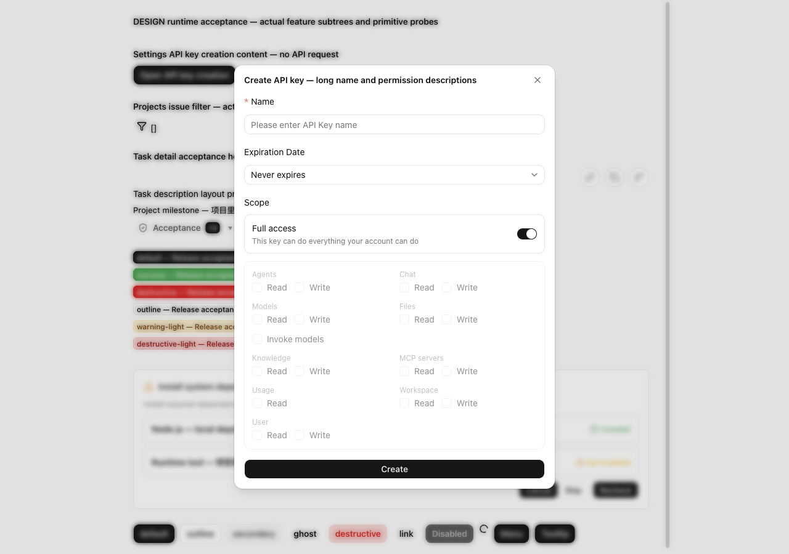       | 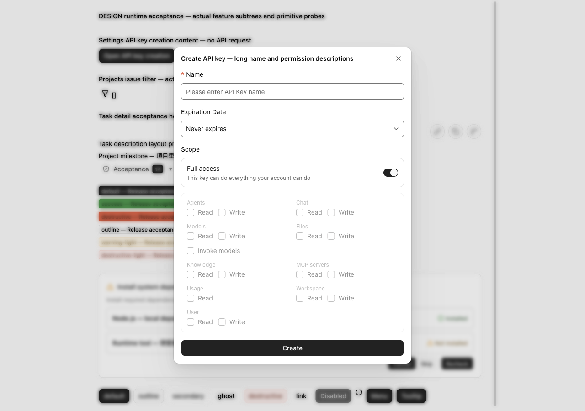       |
| Validation text and input borders: contrast roles                | 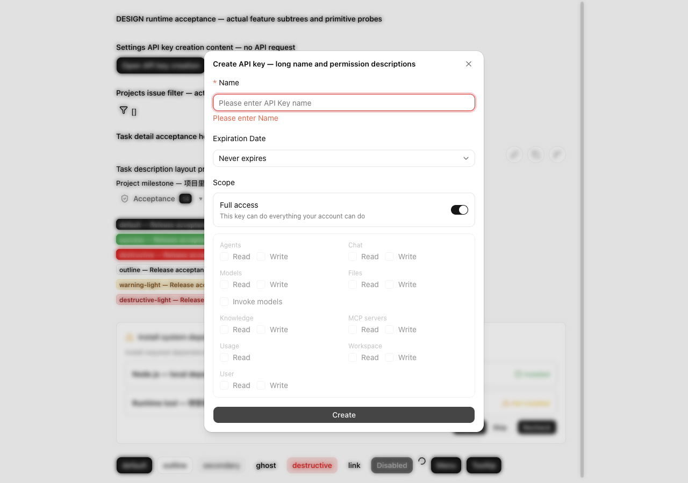 | 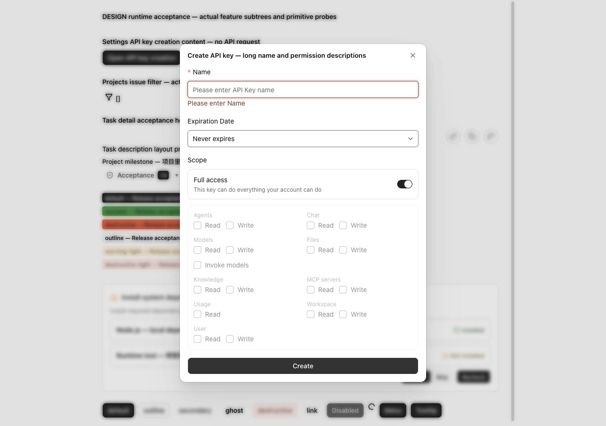 |
| Dark Chinese, blue primary and sand neutral: status/MCP roles    | 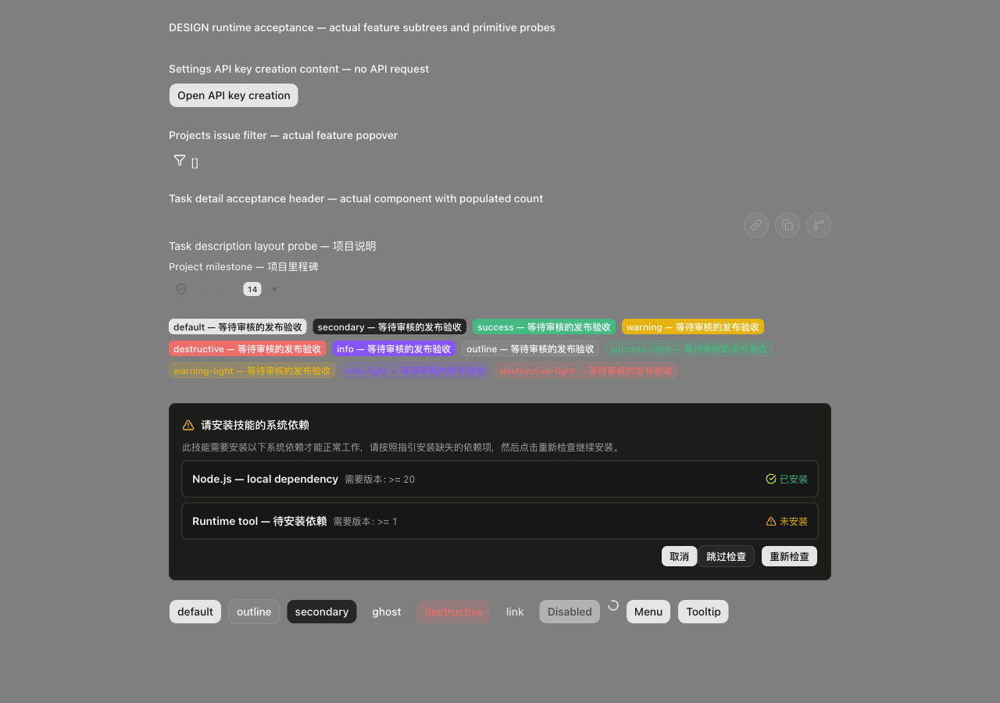             | 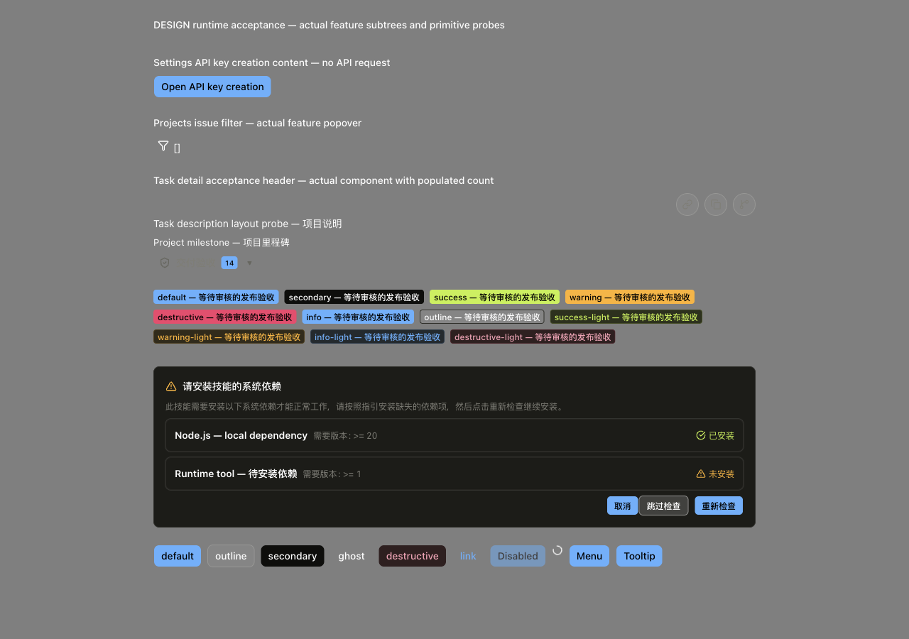             |
| 900px Chinese, yellow primary: readable on-fill text             | 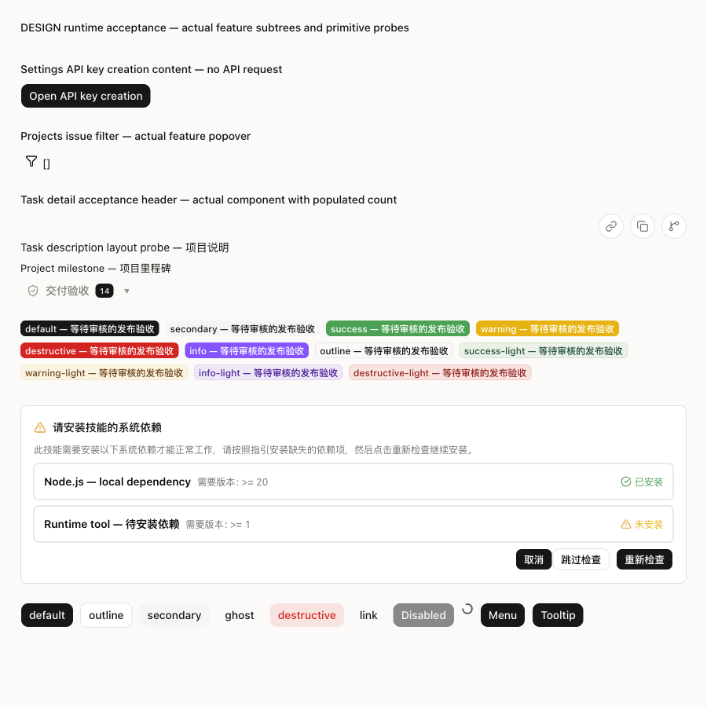             | 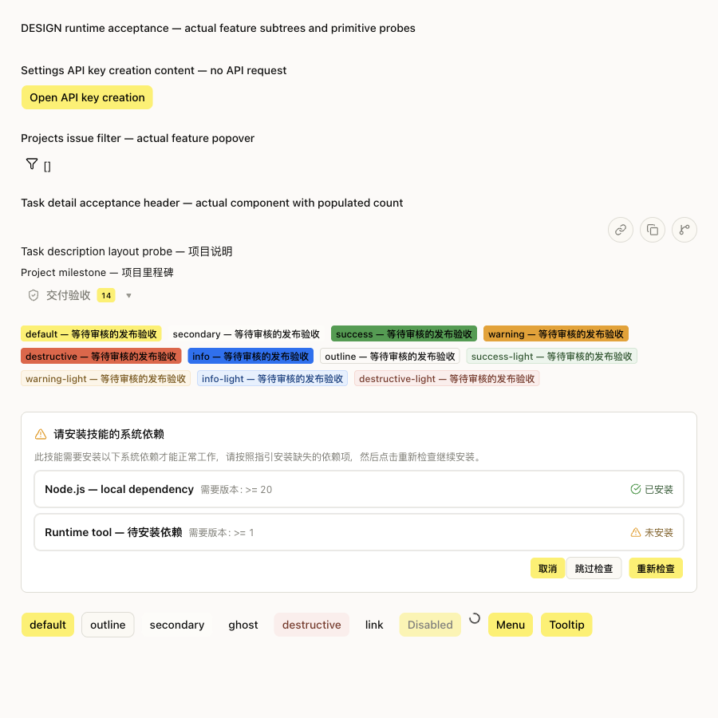             |
| Project issue filter: engine colors and 12px overlay             | 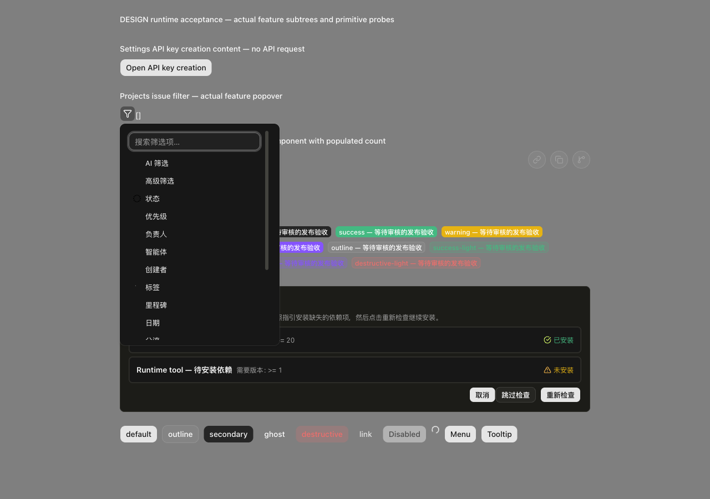       | 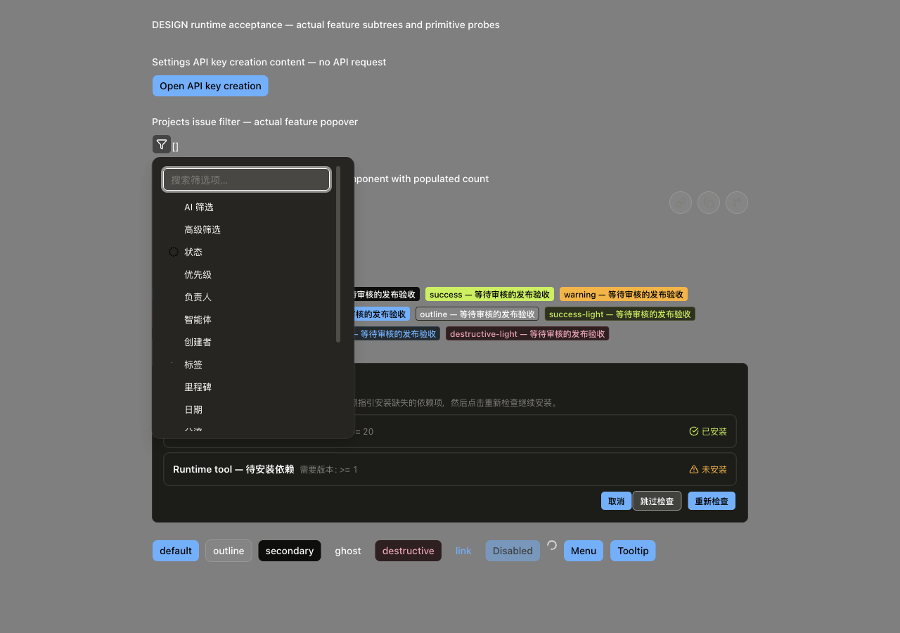       |
| Shared menu: 12px overlay and theme elevation                    | 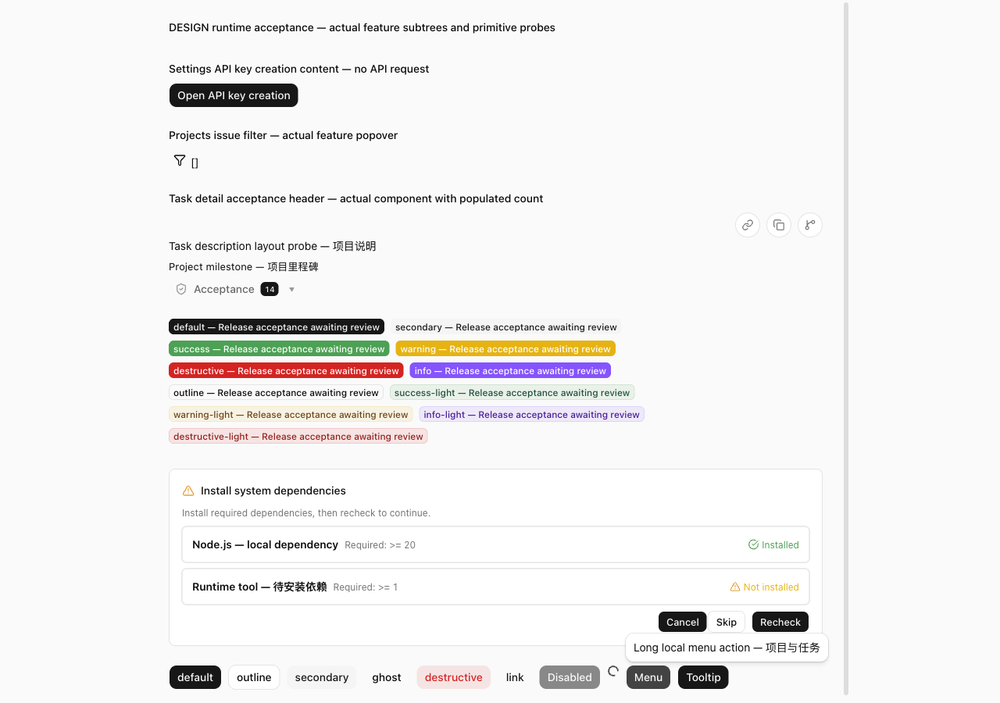               | 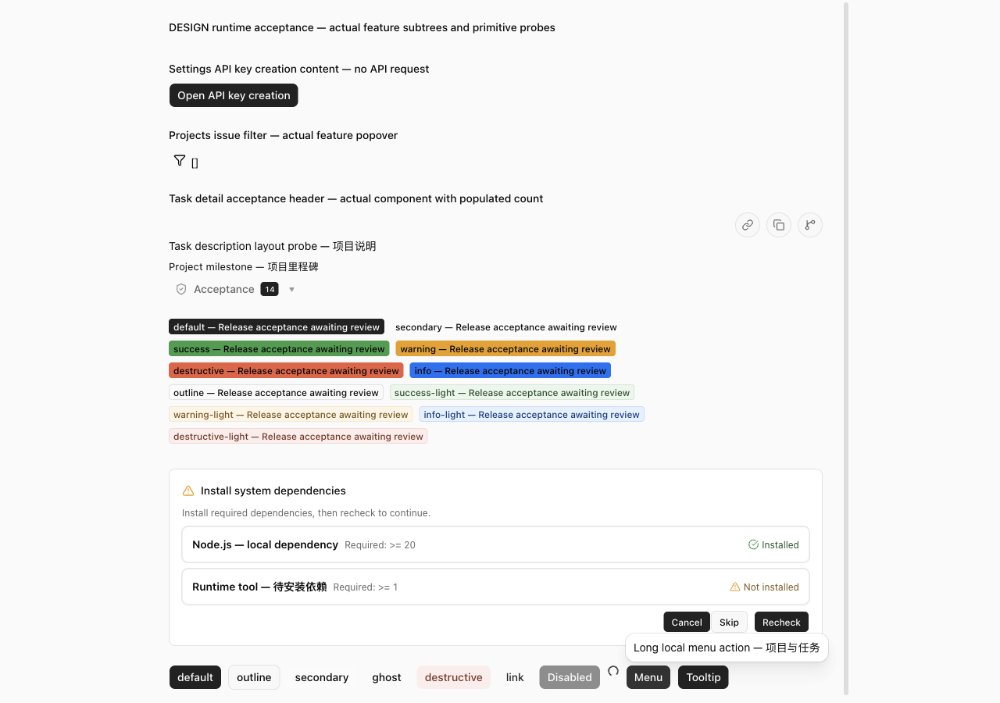               |

The runtime covers actual API key content/portal, project filter, task header, MCP dependency card and labeled primitive probes. It does not certify full application navigation, native backdrop fidelity or backend persistence. The 21 runtime tests and 9 unit tests passed; immutable baseline probes reproduced contrast, date-size and first-paint failures. Independent review found no remaining product P0/P1/P2; reported fixture formatting was corrected and lint passed.

## Standalone Share and Workbench correction

The original combined fixture already imported shared CSS. A separate fixture exposed missing utilities/tokens in the standalone host graph: body margin was already 0px, but flex rendered as block and the button was 21px high with 0px radius. Each host now imports the canonical layered globals; both light and dark pass the new computed-style regressions.

Before source: `b767f24d6240bf82e3ede88bb548f46d3fbcdb41`. Verified stylesheet correction: `3a9248e4edc5395085fd4717cd15f953abb46436`. [Source hashes and measured values](standalone-provenance.json). These supplementary captures use Chromium with the actual standalone theme hosts, rather than the Electron combined fixture.

| Standalone host | Before                                           | After                                          |
| --------------- | ------------------------------------------------ | ---------------------------------------------- |
| share light     |      |      |
| workbench light |  | 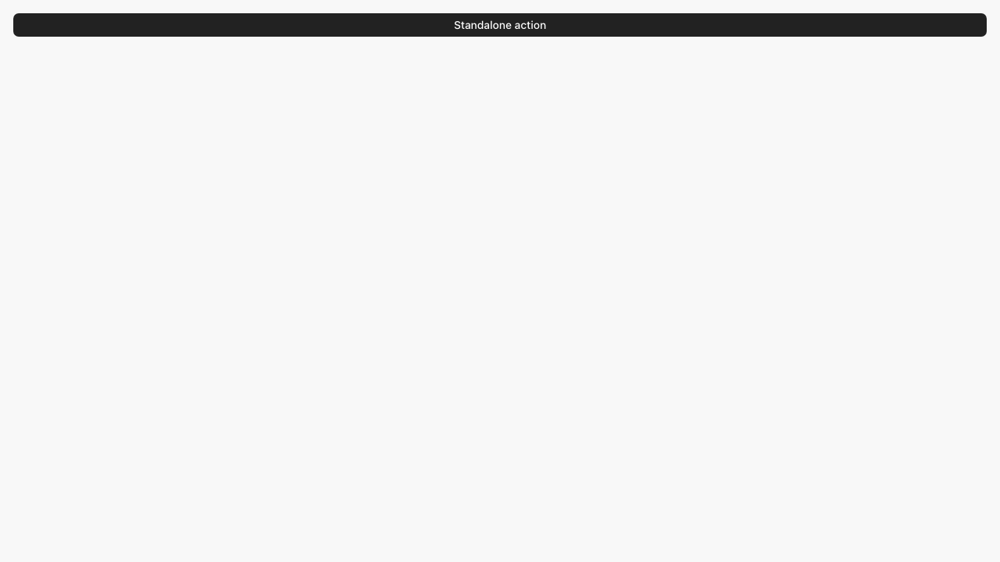 |
