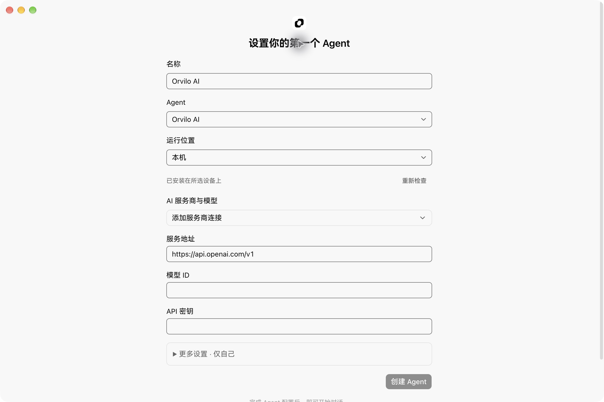
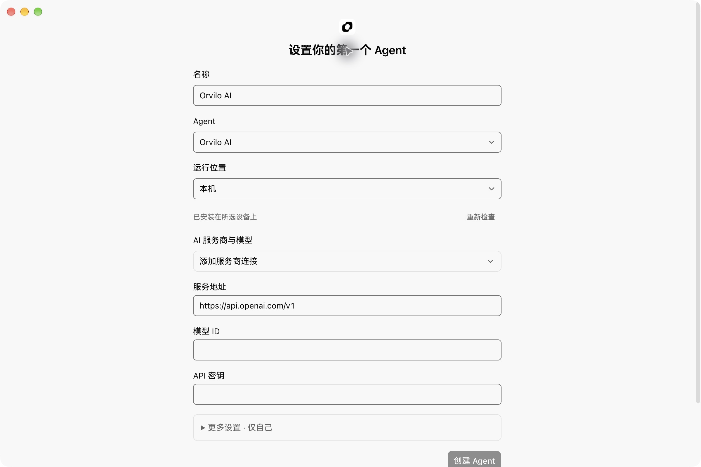
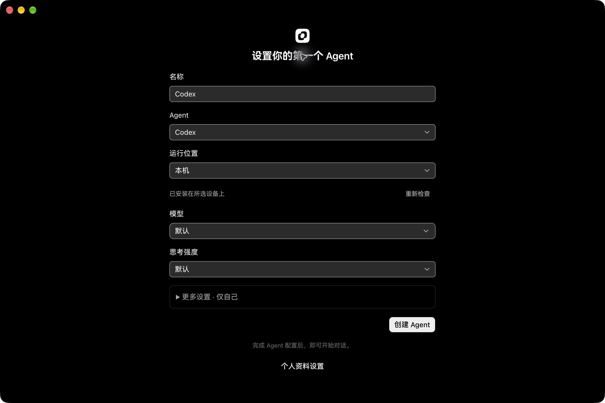
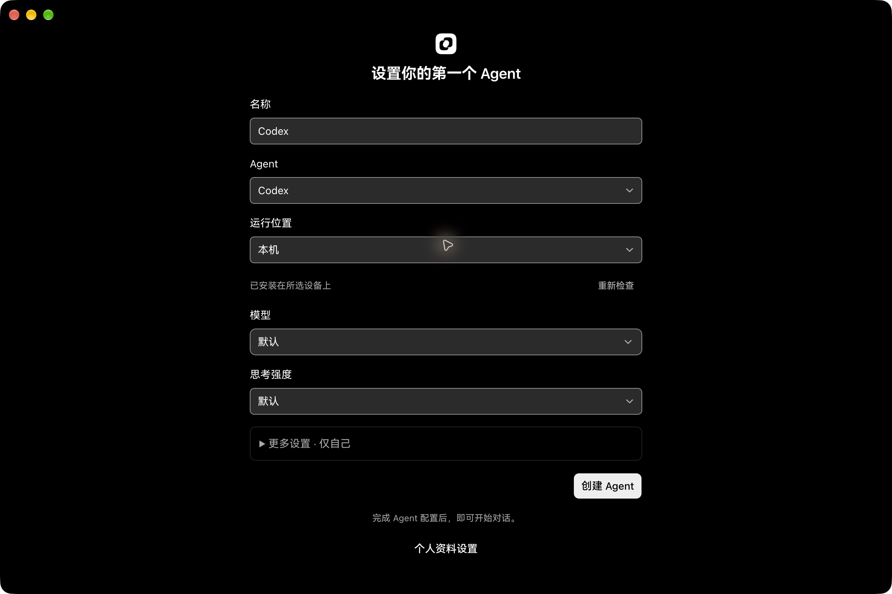
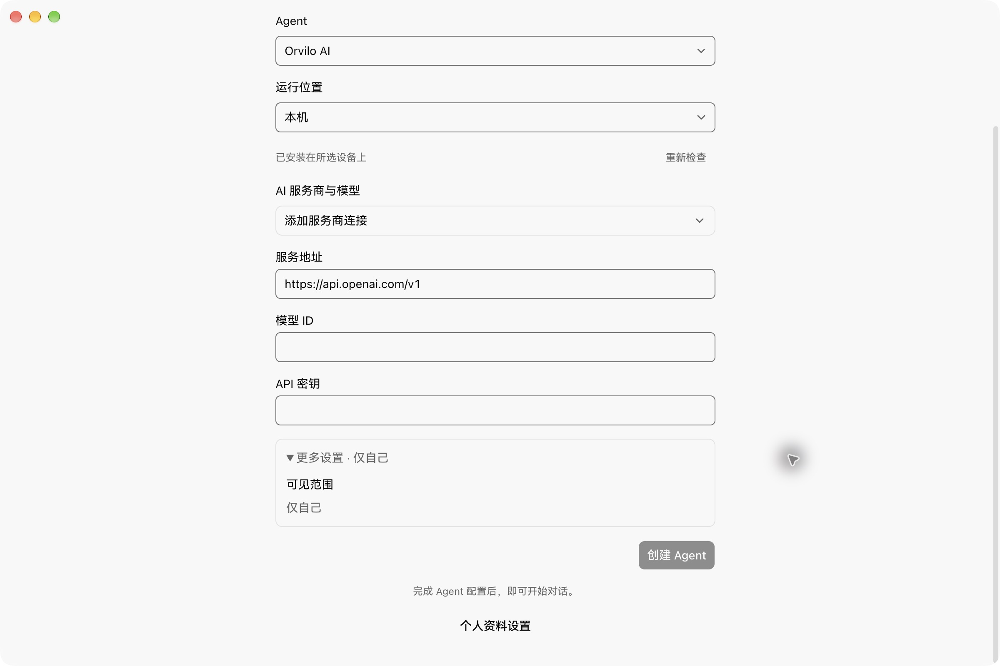

# Real desktop Agent creation evidence

The ordinary Agent creation fields and submit action used the compact 32px default. Product commit `ce737c937445592c084e21bf91b145d8567482ec` explicitly applies the normal 36px role from DESIGN.md, maps the advanced-settings container to the 8px card role, and uses secondary text for the 12px onboarding explanation. Rescan stays 28px. The three existing Settings ModelPicker consumers retain their compact default.

## Actual product verification

These are the real Orvilo Electron application and its normal first-Agent setup page connected to the existing cloud account. They are original native application screenshots. The form has no submitted Agent or credential. The source revision, image hashes and environment are recorded in [provenance.json](provenance.json).

Before uses merged `a8da6ed8fda846ad4fc05432902caaf358c53511`; after uses `ce737c937445592c084e21bf91b145d8567482ec`. Both use the same `/abx/tasks` route, account, 1200×800 logical window (2400×1600 screenshot), zh-CN locale and corresponding appearance. Baseline capture restored the five touched files from the baseline and verified an empty product diff against it. The committed candidate files were then restored exactly. The existing Automatic appearance setting was restored after dark verification.

| Scenario                                                                               | Before                                     | After                                    |
| -------------------------------------------------------------------------------------- | ------------------------------------------ | ---------------------------------------- |
| Orvilo AI setup, light: name, Agent, host, provider, endpoint, model and secret fields |  |  |
| Local Codex preview, dark: normal fields, enabled primary action and explanation       |  |  |

The dark screenshots independently corroborate the five ordinary fields changing by 4 logical pixels: their flat-fill spans at screenshot column 850 change from 60 to 68 physical pixels at scale 2. With the existing 1px CSS borders on each side, their height is 32→36px. This is image evidence plus source geometry, not a computed-style measurement.

Keyboard Tab from the name field moves to the Agent selector with a visible focus indicator. Opening the Agent and model menus preserves their current selected item. The builtin form remains disabled while required provider inputs are empty; the existing local Codex preview exposes an enabled primary action. No submit was performed. Expanding More settings and scrolling the real cover to its end exposes the full creation button, explanation and account escape in light and dark.

Scoped lint and normal commit checks (stylelint, ESLint, Prettier, native-control and host/device-boundary guards) passed. An independent Light reviewer found no introduced P0/P1/P2 issue and confirmed that the Settings ModelPicker default is preserved. This is a style-only repair; no source-string mirror tests were added. Full Typecheck belongs to remote CI.

## Remaining requested work

The existing first-Agent gate covers Projects, API Key, MCP and other ordinary pages because this cloud account has no usable configured Agent. Their source candidates have been identified, but these pages have not been modified or accepted in this follow-up. Completing an existing Agent configuration or selecting an already-configured account/workspace is required to continue. This checkpoint does not certify all frontend surfaces, the native work-page backdrop, backend deployment parity, or an Agent creation transaction.
