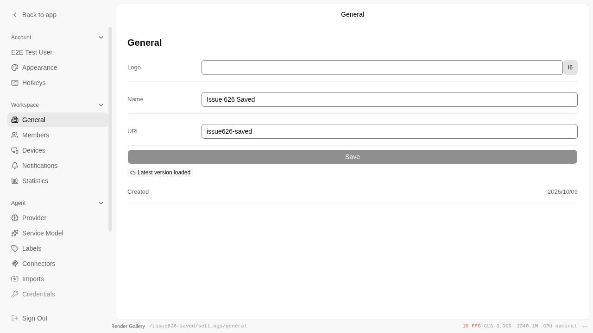
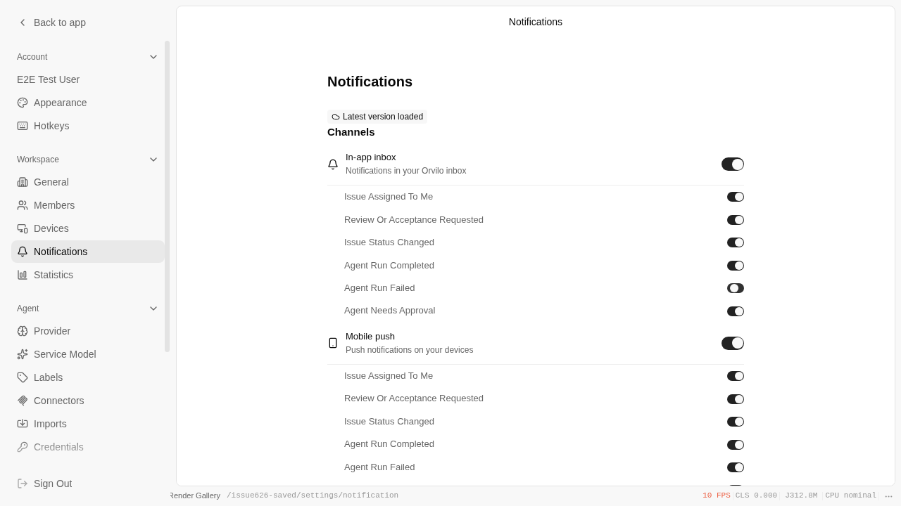

# Issue #626 product verification

Code revision: `109b31653033ec33b17192e576558a2a199a346e` (2026-10-09).

Environment: the real Next/Vite application, Chromium, PostgreSQL/ParadeDB and Redis on localhost. Authentication uses the repository's existing E2E Clerk session fixture. This validates the settings and backend behavior; it does not validate real Clerk login or native Electron notification delivery. No model completion is substituted for a real provider success below.

## Verified outcomes

- Created a workspace through the running `workspace.create` API. In the browser, edited its name and slug, clicked Save, followed the new URL, and reloaded. Both values remained saved.
- In the workspace notification page, disabled the inbox “Agent run failed” event and reloaded. The switch remained off.
- Used the real notification projection service against that same PostgreSQL database and the browser-saved preference. A failed-run event produced no notification while disabled; enabling it produced one. Issue assignment and review-request events also produced their expected notifications. The failure opt-out was restored afterward.
- Through the running provider API, saved only an invalid OpenAI key, enabled the provider and selected `gpt-4o-mini`. Reading the resulting binding returned the official `https://api.openai.com/v1` endpoint and `enabled: false`.
- Called the real `expertise.draftDomain` endpoint for a database-seeded existing CLI Agent fixture. It returned the explicit “CLI agents are not supported” precondition error before model dispatch. This is a server policy check, not a local CLI execution test.
- GitHub Actions Typecheck passed for this code revision: [job 114024952792](https://github.com/alexj11324/orvilo1/actions/runs/37990659797/job/114024952792).

Sanitized output:

```text
saved name after reload Issue 626 Saved
saved slug after reload issue626-saved
failure inbox switch after reload false
failed run notification count with UI opt-out: 0
failed run notification count when enabled: 1
Issue assignment notification delivered
Issue review notification delivered
{"endpoint":"https://api.openai.com/v1","enabled":false,"model":"gpt-4o-mini"}
PASS: actual expertise API blocks CLI owner with explicit explanation
```

## Screenshots

Workspace after save and reload:



Workspace notification opt-out after reload:



## Remaining gates

A successful real model generation remains unverified: the environment's configured Google key returned HTTP 400 `INVALID_ARGUMENT` / “Please pass a valid API key.” A usable provider credential is required. Native Electron notification delivery also remains unverified.

Full Test CI and E2E CI are blocked by Docker Hub's unauthenticated image-pull rate limit. The failed database-container setup cancels sibling jobs; a targeted retry allowed Typecheck to complete successfully but did not resolve the database image pull. These cancelled checks are not passes.

Backend cleanup #622 remains deferred because frontend PRs #612, #615, #616 and #617 are still unmerged. No retired API or database fields were deleted.
