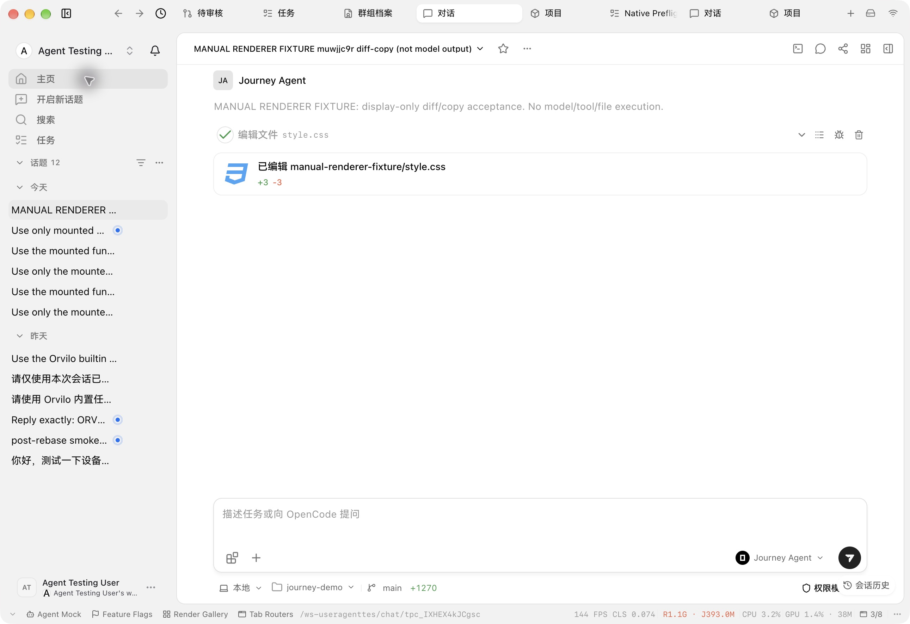
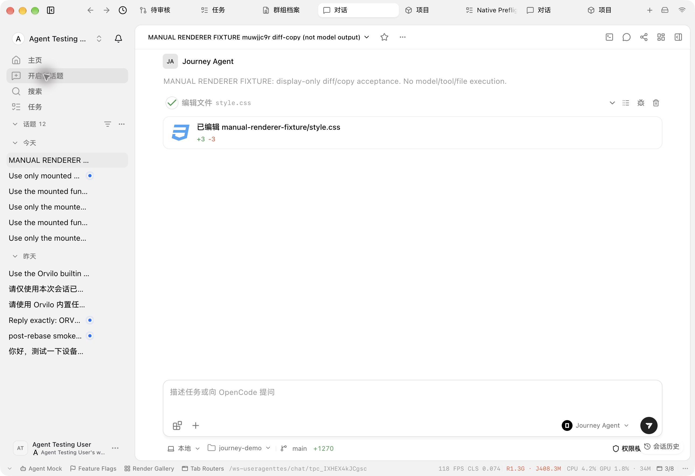
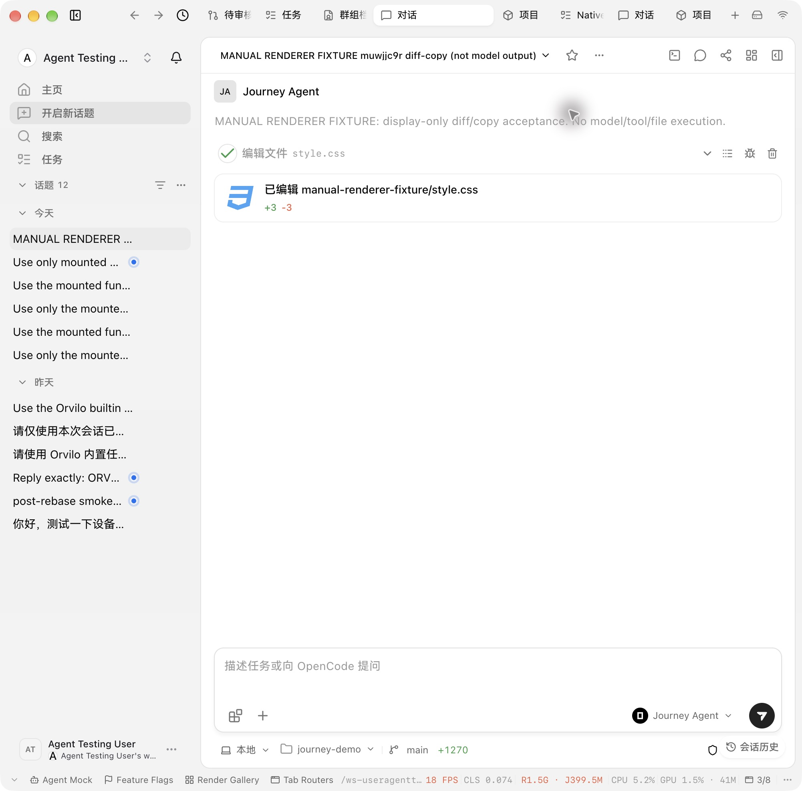
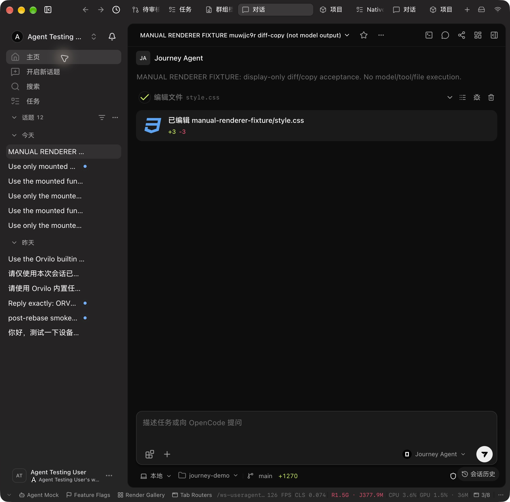

# Agent sidebar navigation verification

Source: `b08a05eb3514be26481bc8db4404735f16f3501c`. Native Electron captures below were produced in the combined working checkout with subsequent Task work. SHA-256 comparisons confirm the three product files and `Header/Nav.test.tsx` remain byte-identical to this commit in both the delivery worktree and runtime candidate `d78fa1eb2678fa8508f8c861d49e9e71dec7c6d9`. This evidence-only attachment changes no product behavior.

Home, New topic, Search and Tasks use one Nav list. Home uses the same icon size, padding and row cadence. Goals and Self-evolution were removed as page entries; their commands remain.

Normal native Search opened the command palette; Home returned to the workspace; Tasks entered the Task route; New topic opened the empty composer without sending. The user confirmed the sidebar issue resolved before moving to Tasks.

## Hover evidence

Home renders a link while New topic renders an action row. Before repair, the link's global transparent background overrode its hover. The first repair passed light mode but failed after switching dark. The final shared `&&:hover` rule uses the existing theme token and passed the actual dark comparison below. Native right-click positioned the pointer over each row without navigating; the ordinary context menu was subsequently dismissed.

Final-source native acceptance now covers light mode at the existing desktop width and narrow windows in both themes, zh-CN and 100% zoom. The full light captures are 2582 × 1772 pixels (1291 × 886 CSS); the narrow captures are 2002 × 1974 pixels (1001 × 987 CSS). Home hover and the shared navigation row cadence passed. These are uncropped JPEGs copied without re-encoding.

The actual macOS Move & Resize → Left operation resized the isolated window; Restore Last Size returned it to the full width, and dark mode was restored. Context menus were dismissed. The earlier ineffective resize attempt remains excluded from acceptance; these later captures provide the narrow-window proof.

## Checks and source identity

The unchanged navigation regression file previously passed 15 tests; scoped lint and normal commit hooks passed. That historical test proof is reused, with no new test run for this evidence update. Independent code/TypeScript review approved navigation and the first hover repair. The final specificity adjustment was linted and verified through Electron; no later independent review is claimed. Remote Typecheck remains a separate CI gate, and no local `tsgo` ran.

- `src/features/AgentSidebar/Header/Nav.tsx`: `7bf10c806c92afac9aa021e5b246c52fd080030cd09553d93f8e92a4f656551e`
- `src/features/AgentSidebar/Header/Nav.test.tsx`: `d67517d46ffb203b4ab4f25b2af02fade9e821a59f0928e422718340de76a83a`
- `src/features/AgentSidebar/Header/index.tsx`: `e2cabb79ae2c949d0e70ea12424cffbc25b00b2c86f58ab6dee076c7a9bd1ca2`
- `src/features/NavPanel/components/NavItem.tsx`: `0447ed9816b981e88a207ac35d81e6896da68a0572b1377f3489e48286d6472e`

The separate CI repair at `3d06aa5bbaf3fb5b2a83c39b478be0d0dcf4d03f` changes only `src/features/Settings/agents/agentSettingsPage.test.ts`, updating its obsolete source read from `Header/index.tsx` to `Header/Nav.tsx`. Its delivered SHA-256 is `9b346c6a646c0868a7da1ce2ecb19b56a9efd46f756347327a690a0ce95583b8`; the runtime candidate retains the earlier test hash `b956d769077a9172ff5aa82872668f7049bab66e487650626318e6c359ce5ace`. This test-only difference does not change the captured product code or extend the historical 15-test result to a new test run.
