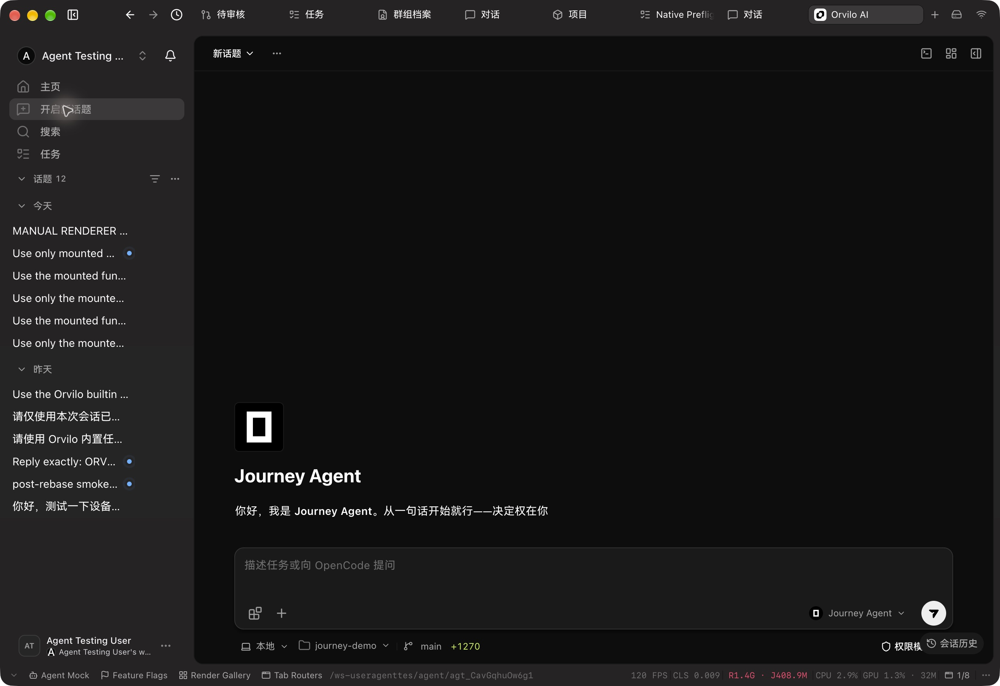

# Agent sidebar navigation verification

Source: `b08a05eb3514be26481bc8db4404735f16f3501c`. Native Electron captures below were produced in the combined working checkout with subsequent Task work; all four sidebar source/test files remained byte-identical to this commit. This evidence-only attachment changes no product behavior.

Home, New topic, Search and Tasks use one Nav list. Home uses the same icon size, padding and row cadence. Goals and Self-evolution were removed as page entries; their commands remain.

Normal native Search opened the command palette; Home returned to the workspace; Tasks entered the Task route; New topic opened the empty composer without sending. The user confirmed the sidebar issue resolved before moving to Tasks.

## Hover evidence

Home renders a link while New topic renders an action row. Before repair, the link's global transparent background overrode its hover. The first repair passed light mode but failed after switching dark. The final shared `&&:hover` rule uses the existing theme token and passed the actual dark comparison below. Native right-click positioned the pointer over each row without navigating; the ordinary context menu was subsequently dismissed.

The final source was verified in dark mode at the existing desktop width, zh-CN and 100% zoom. Earlier light observations cover the prior hover iteration; final-source light and narrow geometry are not claimed. A resize attempt did not change the frame and is excluded from acceptance.

## Checks and source identity

The navigation regression file passed 15 tests; scoped lint and normal commit hooks passed. Independent code/TypeScript review approved navigation and the first hover repair. The final specificity adjustment was linted and verified through Electron; no later independent review is claimed. Remote Typecheck remains a separate CI gate, and no local `tsgo` ran.

- `src/features/AgentSidebar/Header/Nav.tsx`: `7bf10c806c92afac9aa021e5b246c52fd080030cd09553d93f8e92a4f656551e`
- `src/features/AgentSidebar/Header/Nav.test.tsx`: `d67517d46ffb203b4ab4f25b2af02fade9e821a59f0928e422718340de76a83a`
- `src/features/AgentSidebar/Header/index.tsx`: `e2cabb79ae2c949d0e70ea12424cffbc25b00b2c86f58ab6dee076c7a9bd1ca2`
- `src/features/NavPanel/components/NavItem.tsx`: `0447ed9816b981e88a207ac35d81e6896da68a0572b1377f3489e48286d6472e`
