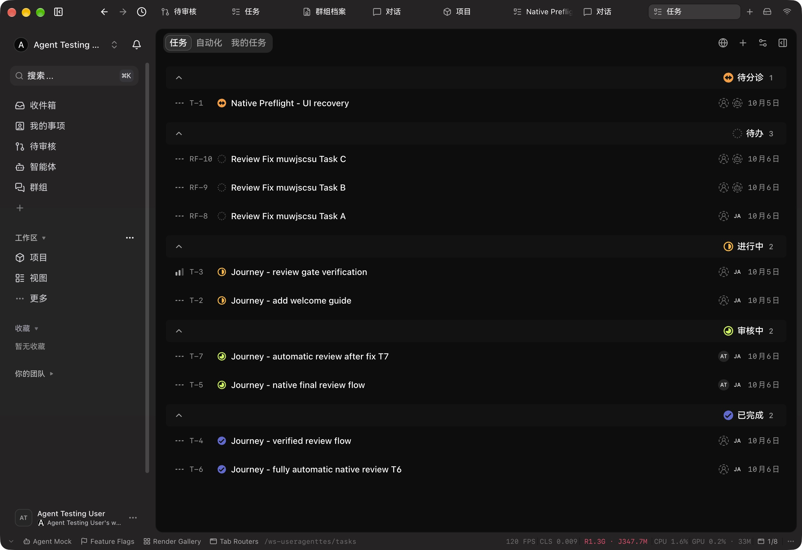

# Workspace Task sharing verification

Runtime source: `57d1293aa52596dad1599acc341021149caff166`. Delivery source before evidence: `a2642a005560df7222db5ff98036f5143c395f0e`. All 20 delivered Task source/test files match the runtime candidate by SHA-256; [filtered facts and hashes](./task-sharing-evidence/runtime-proof.json) record the reuse boundary. The candidate also contained separate sidebar work. Later canary copy changes are not claimed as a new renderer verification.

## Observed product outcomes

- The actual Electron populated list has one workflow icon per row, with redundant execution and privacy icons removed. The screenshot was captured before the row commit on base `b08a05eb` with the frozen row diff; its row files match delivery unchanged.
- Normal owner `task.updateVisibility` shared nine exact screenshot records; T1 was already shared. A temporary second member could read all ten. The same user in their own other workspace could read none.
- One normal `task.create` without visibility created shared T11 assigned to the owner's personal Journey Agent, without a project, automation or human assignee. The second member could read it.
- One real second-member `task.run` returned `404 / NOT_FOUND / Agent not found`. Status, revisions, generation and update time stayed identical; dispatch, topic and operation counts stayed zero. No ACP or provider was launched.
- Personal Agent configuration remained inaccessible to that member. The original Agent configuration fingerprint, devices and memberships were unchanged after exact temporary-member cleanup. T11 remains a labelled local fixture; no task SQL writes or global privacy migration occurred.

## Quality evidence

| Scoped invocation                                   | Passed |
| --------------------------------------------------- | -----: |
| Task service, runner and Agent router               |    164 |
| Task model and Agent access isolation               |    215 |
| Linear planning                                     |     10 |
| Dispatch service and runner                         |     42 |
| Dispatch model                                      |     40 |
| Final shared-task and reassignment-race integration |      2 |
| Inline task creation                                |     26 |
| Task list rows                                      |     25 |

Counts overlap across invocations and are not a unique total. Regressions failed before repair. Scoped lint and normal source commit hooks passed. Independent code and database follow-up approved; TypeScript follow-up resolved the race and found an explicit test `this` annotation, which was fixed before the final two integration checks. Historical backend test outputs retained locally are labelled tool-result summaries; the final integration and frontend/row records are complete process logs. Remote Typecheck and required CI remain separate gates; no local `tsgo` ran.

## Boundaries

Explicit task privacy, private-parent, team, personal and cross-workspace read predicates remain. Sharing task metadata does not grant access to private execution histories or Agent credentials. Live owner execution was not repeated; owner/delegate allowance is covered by scoped SQL and runner checks. Existing UI form drafts were preserved, and no new UI theme or geometry matrix is claimed for this Task change.
