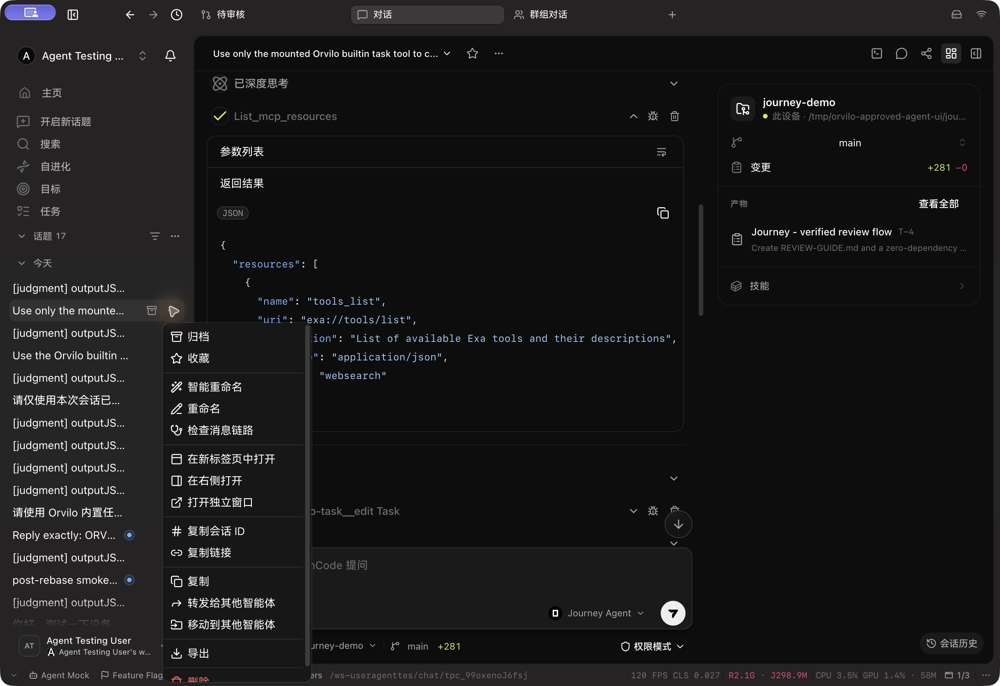
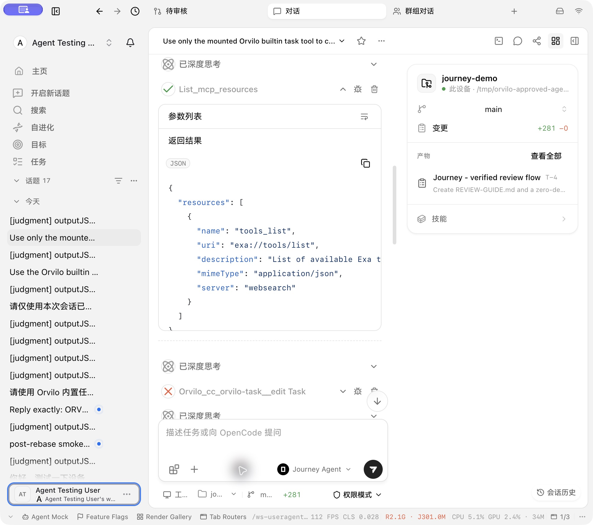

# UI migration recovery

The migration to composable UI components must preserve each caller's existing controls and layout. This recovery addresses the photographed conversation and topic-menu regressions.

- Menus size to their content, with a 192px default minimum and the platform's available-width cap. Explicit widths and multiline descriptions remain supported.
- Shorthand CodeBlock restores language and copy controls. Explicit children own the chrome; copy-only children preserve intentionally hidden language labels. Embedded tool code uses ghost framing inside its enclosing card.
- Edited-file previews use semantic diff rows and dual line numbers; their copy control keeps the original patch, including file headers and addition/removal markers. Metadata-only patches retain readable text.
- Accordion actions sit beside the trigger. Callers that allow independent sections explicitly set multiple. Labelled dividers use two lines around their label.
- Conversation paragraph spacing and process-to-result spacing are restored. The syntax-theme preview uses the same highlighter as conversation Markdown and receives the selected theme.

## Verification

Renderer source revision: [`599b11e5bc00a575ef9cc99548c8e48d0563d1d3`](https://github.com/alexj11324/orvilo1/commit/599b11e5bc00a575ef9cc99548c8e48d0563d1d3). GitHub still serves this original verification commit after the patch-equivalent rebases. The authenticated Electron fixture displayed the existing twelve-call conversation. Its empty-argument resource result has one outer frame and one divider; Copy changed to Copied, and the independent expand action kept the workflow open. Long Chinese topic actions remain on one line. Native windows were checked at approximately 1000px and 1290px in dark and light appearance.

Forty focused rendered regressions pass (CodeBlock, workflow actions, edited-file previews, empty arguments). The owning package checks add 31 tests, and the sidebar menu adapter adds five. The new CodeBlock test exercises actual clipboard output and rendered opt-outs; it is retained to satisfy the repository's bug-regression requirement despite the component-test advisory. Remote Typecheck and full E2E status are separate CI gates.

## Review follow-up

The shared unified-diff parser counts remaining old/new hunk lines before recognizing file headers, so removed CSS custom properties and added source beginning with `++ ` remain visible. Copy controls reuse the existing English and Simplified Chinese `common.copy` and `common.copySuccess` translations; explicit caller labels retain precedence. The rendered/parser regression set passes 26 checks, including the newly reproduced failures. Original screenshots cover the unchanged framing. Follow-up renderer verification on `1dd452becde9cc2dfbdfd24c360db7be80eccce4` uses a manually seeded display fixture: [native diff](ui-migration-evidence/1dd452bec/diff-content-final-native-1dd.jpg) retains the removed `--color: red`, added `++ value` and later file hunk. [Native accessibility feedback](ui-migration-evidence/1dd452bec/copy-feedback-1dd.ax.txt) records the button changing to 已复制；[clipboard paste](ui-migration-evidence/1dd452bec/copied-original-patch-native-1dd.ax.txt) records the full original two-file patch. The feedback screenshot did not visibly show that label, so accessibility evidence is used for this outcome. No model or file-edit execution is claimed. The fixture draft was cleared; original clipboard restoration is not claimed. [Affected source hashes](ui-migration-evidence/1dd452bec/source-hashes.json) remain unchanged on combined candidate `233f3cbe04467e6aea252faacec56b93c43f7df9`, which retains the actual tested revision as an ancestor.
