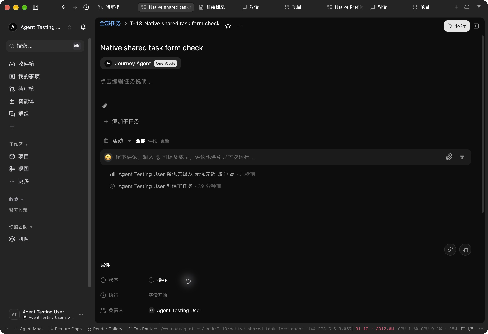

# Workspace Task metadata

Workspace Tasks are shared metadata within their workspace. Legacy rows with a stored private flag are read as public without a data migration. Old clients that submit private visibility on create, update or transfer receive the canonical workspace value. Personal scope stays owner-only, and private-team membership remains an independent restriction.

The same rule applies to grouped Tasks, parent metadata, Project and Recent results, notifications, collaboration rooms, Work projections and Linear conflict context. Private execution-topic titles, non-Task Work privacy, orphan ownership and private Agent configuration/execution remain protected.

This layer depends on the execution authorization repair in PR #479. Privacy controls and filters are removed in a separate UI layer; board markers are tracked independently in PR #480.

Validation on source files frozen from `511a6c2ca37adb2e28ef9af253bc7e1d8974d4af`: 735 distinct tests passed across Task/Topic models, server Task flows, related metadata readers, rooms, Work projections and Linear conflict context. Scoped lint passed. Independent code, database and TypeScript reviews found and verified fixes for ranked-group projection and Drizzle alias types. No local type check ran; remote CI remains a separate gate.

Real HTTP acceptance passed on the populated local fixture at local candidate `6818b5c0fae2a08030965ee6bd54080282aa2cca`. Its complete `apps/server` and `packages/database` Git trees, root package manifest and lockfile match source delivery `94512f2899ba1bfb503106d3ecb6380f178a9b82`; the local candidate also contains separate UI layers. The [sanitized evidence](./workspace-task-metadata-evidence.json) records both backend tree IDs and all 28 source/test hashes. This proves backend behavior and does not claim native UI screenshot acceptance.

Eleven normal HTTP calls showed the legacy stored-private Task as public in member find, private-filter list and all three ranked groups, while the raw row stayed unchanged during reads. Foreign workspace access was denied. Private Agent configuration returned empty, and a member run returned HTTP 404 before any Task, dispatch, topic or operation effect. Explicit-private create and update requests returned and persisted public. The original Task and membership were restored, Agent/device fingerprints stayed unchanged, and no provider or ACP ran. One nonexecuting public fixture was retained.

The probe had two corrected setup issues: a signing-key environment mismatch stopped before Task/API access; a response-shape extraction error stopped after two metadata reads. Each attempt cleaned its temporary membership and restored its fixture before the passing run. TaskWork and Project fixtures were absent; those projection boundaries and personal/private-team isolation are supported by the maintained tests above.

## CI regression repair and native update

Remote CI exposed a real audit regression: public normalization entered change classification before persistence, producing a visibility event for an ordinary field update. Normalization now runs after classification. Updated fixtures preserve independent private-team restrictions; 269 focused tests and lint passed, with independent code and TypeScript review of this six-file repair. On source delivery `968704b36c170de7eb0a3b0d6b2003d0db2f79d5`, remote database CI passed 258 files and 5488 tests; Typecheck and the required quality gate also passed.

The normal Electron priority picker updated the modal-created fixture from priority 0 to 2 on local candidate `d78fa1eb2678fa8508f8c861d49e9e71dec7c6d9`. Read-only verification found exactly one new event containing only `priority`, domain revision +1, and unchanged policy/requirement revisions. Both modal and inline-created fixtures remained public with their selected private Agent and human owner; the inline fixture was unchanged. Dispatch, topic and operation counts remained zero, and original Agent/device fingerprints matched. The [sanitized receipt](./workspace-task-domain-evidence.json) identifies the equivalent delivered backend and its 33 source/test hashes. Quiet context writes are covered by the maintained regression test, without claiming a native context update.

