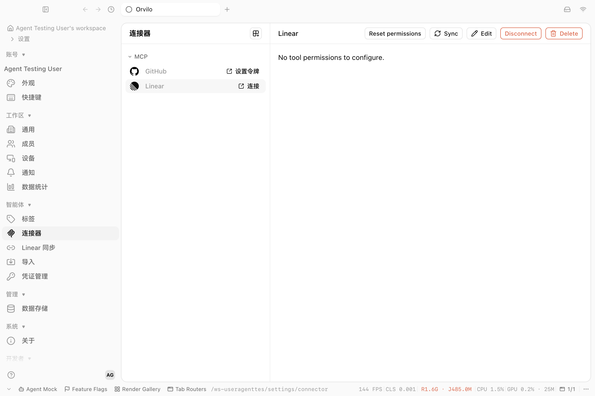

# Connector catalog and Linear OAuth handoff acceptance

Source revision: `e61d65fd0` on `fix/connector-oauth-entry`. The Electron renderer ran from this worktree with an isolated user data directory and CDP port `9264`. It used the local seed account and the local backend on port `3010`.

1. Opened `app://renderer/ws-useragenttes/settings/connector`. The MCP catalog showed GitHub and Linear; Notion and Slack were absent. Existing custom connectors remain in their own section by design.
2. Clicked Linear **Connect**. The app created the `linear-mcp` connector and opened the authorization URL through the system browser. It did not show the manual MCP configuration form or the previous popup-blocked error.
3. After reloading the updated locale bundle, the Electron handoff showed: “请在浏览器中完成授权，然后返回连接器页面。” The button returned to **Connect** while authorization remained incomplete.

The provider consent and callback were not completed in this run. The backend was the separate local parity worktree, so this screenshot does not verify the new workspace-scoped callback code. Focused checks on this branch passed: catalog visibility 2 tests; Linear popup/focus and connector store 13 tests; backend callback/state 8 tests. Root `tsgo` was not run locally; remote CI is the type gate.
