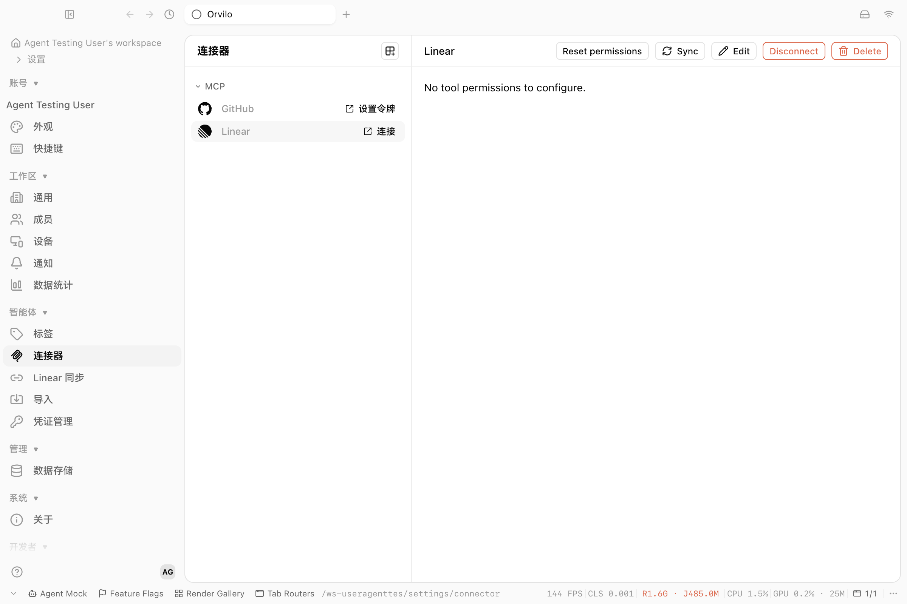

# Connector catalog and Linear MCP OAuth acceptance

## Connected runtime acceptance

Source revision: `469d3aa67e47d07f88938975ad727a634fc25b28` on
`fix/connector-oauth-entry`. The Electron renderer, local backend, and isolated
database all ran from this worktree. The recorded result is available in
[`runtime-result.json`](./runtime-result.json).

1. Clicked Linear **Connect** in Electron and completed the provider consent
   flow in the system browser.
2. The callback completed successfully. The isolated database contained one
   connected `linear-mcp` row with credentials present and 68 synced tools.
3. Reloaded the Electron connector page. It rendered the connected Linear
   connector and grouped all 68 tools as 38 read, 25 create, 1 update, and 4
   delete tools.
4. Called the read-only `list_teams` MCP tool through Electron's real connector
   execution path. The call succeeded and returned two accessible teams with no
   next page. No write tool was called.
5. Focused Vitest passed 3 files and 10 tests. The focused repository lint check
   passed for all 8 changed files. Independent review approved the change with
   no release-blocking findings.

The scoped `apps/server` TypeScript check exhausted the default 4 GB Node heap
and exited 134 without a type diagnostic. Full type validation remains a remote
CI gate. The local acceptance services were stopped after evidence collection.

The image below records the earlier catalog and browser-handoff state at
`e61d65fd0`. It establishes the Electron entry point and system-browser handoff;
the JSON result records the later connected acceptance at `469d3aa67`.

## Earlier handoff-only evidence

Source revision: `e61d65fd0` on `fix/connector-oauth-entry`. The Electron renderer ran from this worktree with an isolated user data directory and CDP port `9264`. It used the local seed account and the local backend on port `3010`.

1. Opened `app://renderer/ws-useragenttes/settings/connector`. The MCP catalog showed GitHub and Linear; Notion and Slack were absent. Existing custom connectors remain in their own section by design.
2. Clicked Linear **Connect**. The app created the `linear-mcp` connector and opened the authorization URL through the system browser. It did not show the manual MCP configuration form or the previous popup-blocked error.
3. After reloading the updated locale bundle, the Electron handoff showed: “请在浏览器中完成授权，然后返回连接器页面。” The button returned to **Connect** while authorization remained incomplete.

The provider consent and callback were not completed in this run. The backend was the separate local parity worktree, so this screenshot does not verify the new workspace-scoped callback code. Focused checks on this branch passed: catalog visibility 2 tests; Linear popup/focus and connector store 13 tests; backend callback/state 8 tests. Root `tsgo` was not run locally; remote CI is the type gate.
