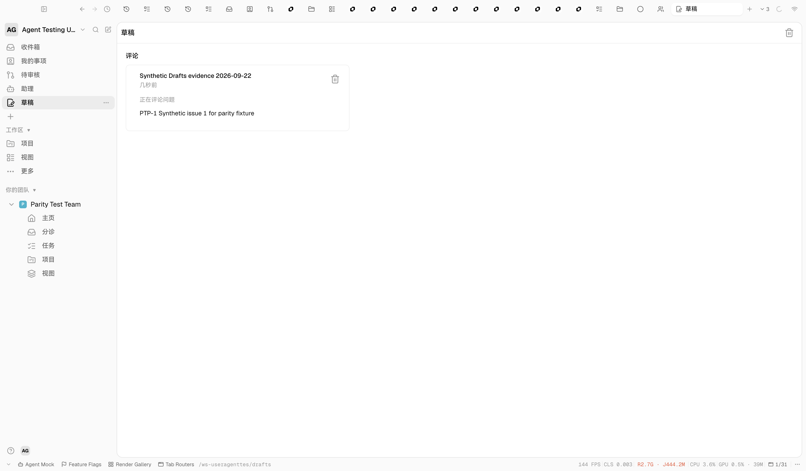
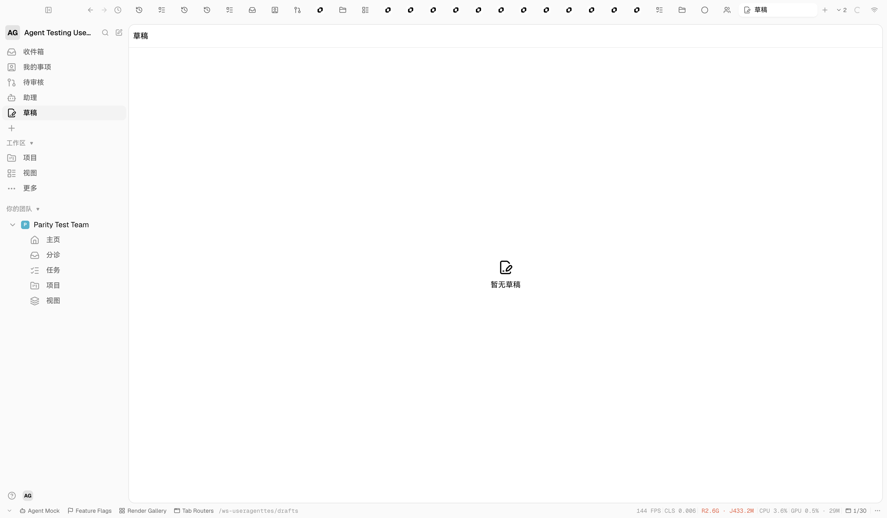

# Drafts runtime verification — 2026-09-22

Implementation revision: `c5293bc3a6e6ac1a038e78e45c10398a31b41f58`. Verified against the running Electron renderer and local synthetic workspace `GQyFjgmp3ci2UW5k`, task `PTP-1`. The reference Drafts page was inspected without changing its data.

1. Entered `Synthetic Drafts evidence 2026-09-22` in the task comment editor. Autosave created one workspace-scoped draft; no comment was sent.
2. Opened the sidebar Drafts entry. It resolved under `/ws-useragenttes/drafts` and showed the comment card, task identifier, content, and sidebar count. The card's Edit action used the public `PTP-1` route and restored the rich editor document.
3. Returned to Drafts, discarded the synthetic card, and verified that the list and sidebar count became empty. No synthetic draft remained afterward.

The screenshots prove the local synthetic Drafts journey at this revision. They do not prove every visual state or interaction on the populated Linear reference page.
