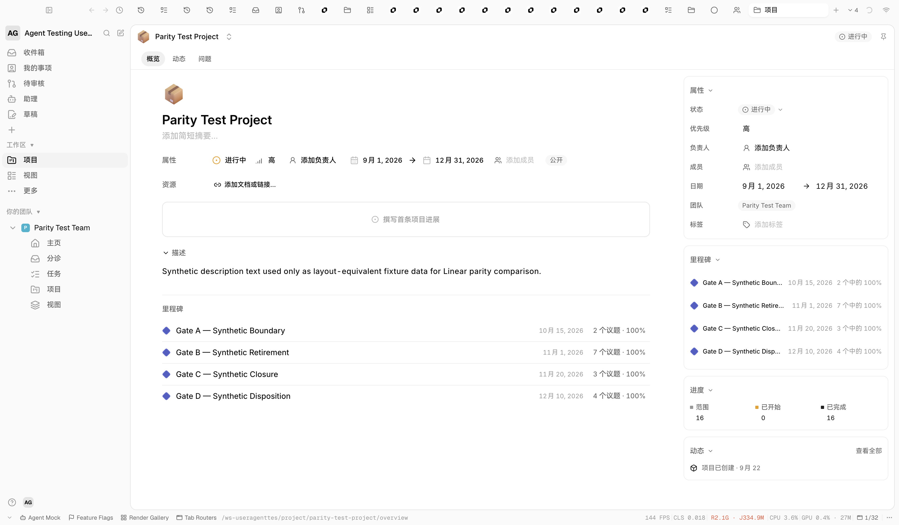

# Project Overview property hover verification

Implementation revision: `963aa7a06e4bcc851c5dfdd7863b13f570792fd2`.
Observed in the running Electron renderer at `app://renderer/ws-useragenttes/project/parity-test-project/overview`, 1686 × 986 CSS pixels at DPR 2. The test moved the CDP pointer onto each visible main property-row control, waited for hover styling, and compared every row child's `getBoundingClientRect()` with its unhovered position. It did not click or change project data.

Before the CSS fix, hovering Priority changed its button border from `0px` to `1px`, widened it from 57.28 to 59.28px, and moved Lead and every later control 2px right. The same 2px shift occurred when hovering Lead or either date picker. This explains the reported horizontal jitter.

The inline controls now reserve a transparent 1px border in the resting state. After the fix, hovering Status, Priority, Lead, both date pickers, Members, and Visibility produced **zero changes** in any property-row child's x, y, width, or height. Scoped lint and 13 related tests passed; the hover behavior was checked on the real Electron page after the commit.

This verifies the reported layout shift only. The right rail's icon and missing-content differences remain tracked in ORV-129 and ORV-132.
