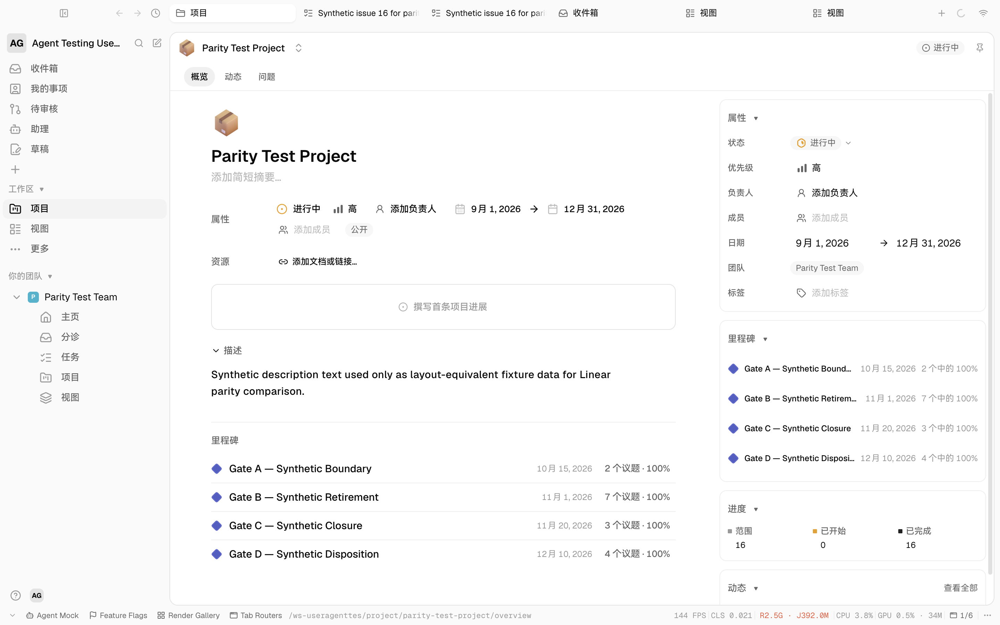

# Project right-rail icon verification — 2026-09-22

Implementation revision: `a1478716b8b60fc0f64d40e3c3fe5070a1206872`. In the running Electron renderer at `/ws-useragenttes/project/parity-test-project/overview`, 1440 × 900 CSS pixels at DPR 2, all four right-rail section headers rendered the measured filled 16 × 16 disclosure arrow. The active/In Progress status rendered the measured 16 × 16 perimeter SVG with yellow computed stroke `rgb(238, 158, 11)`.

A real pointer click on Properties collapsed the section (`aria-expanded=false`, content hidden, arrow unrotated); clicking again restored `aria-expanded=true`, visible content, and the 90° arrow rotation. Focused lint and 57 related tests passed. The screenshot records the populated synthetic project state after the icon change.

Properties and Milestones add actions remain unimplemented because post-create dependency and milestone mutations do not yet exist. Team and Activity icon shapes also remain open. This evidence proves the measured glyphs and collapse interaction only.
