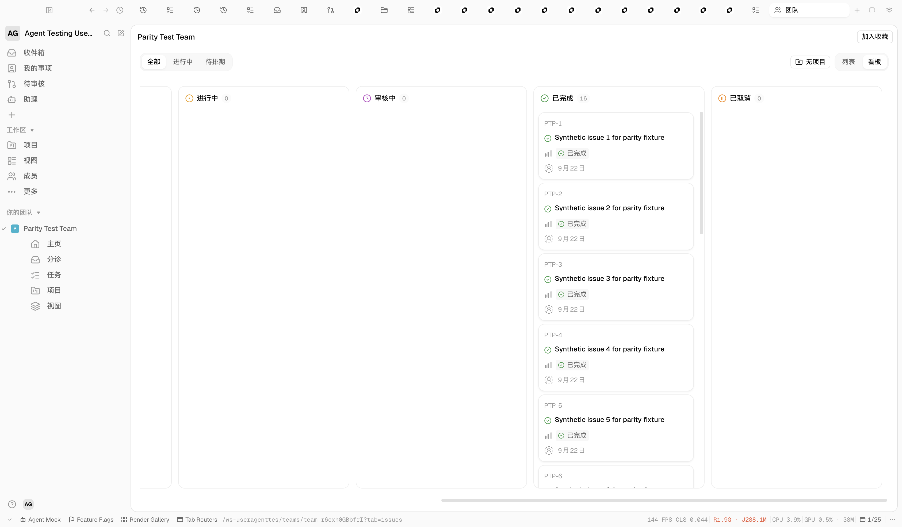

# Team seed runtime verification — 2026-09-22

Verified seed implementation in this commit, on application baseline `a97d07cfebfef1b01c0db354f450e348dc44f84d`. No application source changed in this seed concern.

- Target was explicitly checked as localhost:5432, database `orvilo_linear_parity_20260922`.
- Ran `ORVILO_PARITY_SEED_TARGET=local ORVILO_PARITY_WORKSPACE_ID=GQyFjgmp3ci2UW5k bun run workflow:seed-linear-parity` twice.
- Both returned workspace `GQyFjgmp3ci2UW5k`, team `team_r6cxh0GBbfrI`, existing project `prj_vnEhstgvvas1`, 16 tasks, 4 milestones. Second run exited 0 after the CLI pool-close fix.
- Reloaded actual Electron renderer using CDP 9222. Sidebar now contains joined `Parity Test Team` with Home, Triage, Issues, Projects and Views children.
- Clicked sidebar Issues; URL changed to `/ws-useragenttes/teams/team_r6cxh0GBbfrI?tab=issues`. List showed Completed 16, PTP-1 through PTP-16.
- Clicked Board. Completed column showed 16 with the same task identifiers. Scrolled horizontally to that column and captured the screenshot below after paint.
- Project Overview still showed milestone allocation 2/7/3/4 at 100%.
- Database regression suite covers fresh data, idempotent repeat, missing relation repair and foreign collision refusal: 4 tests passed; scoped lint passed.

This verifies fixture population, navigation and task retrieval. It does not certify full Linear visual or interaction parity for the team page. The all-completed fixture intentionally leaves the other board columns empty.

> Historical evidence boundary: this screenshot and 16-row Team Issues count were produced by
> seed revision `df5e94627`. The maintained seed now also adds six projectless, team-owned `PMI-*`
> rows for My issues verification, so current Team Issues contains 22 rows. Project Overview is
> unchanged: its four milestones still contain only the 16 completed `PTP-*` rows.
